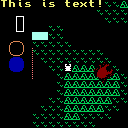

# gfx



Fantasy console (similar to [PICO8](https://www.lexaloffle.com/pico-8.php))
* made with C and SDL2
* has python27 binding
* permissive license (MIT)
* very minimal, great starting point for making your own fantasy console

# building

I use gcc and mingw32.  
To build the python module:

`make gfx`

(you will need to edit PYTHON_PATH and PYTHON in Makefile to point to your python installation)  

To install in python, use distutils:

`python setup.py install`

All this does is copy `gfx.pyd` and SDL .dlls to site-packages.  

Then it should work:  
_helloworld.py_

```
from gfx import *

def __update__():
    color(YELLOW)
    text(0, 0, "Hello World")
    
def __name__ == "__main__":
    init()
    load_spritesheet("assets/spritesheet.bmp")
    mainloop()
```

The batch file `build.bat` will automatically build, install and test gfx for you (if you have PYTHON27 in your environment variables)

# API

Drawing methods:
* point
* line
* rect
* rectfill
* circ
* circfill
* text
* sprite
* map

see test.py for python example usage  
see mapedit.c for C example usage  
(run `make mapedit` to build the `bin\mapedit.exe` tool)

# Asset Files
Unlike PICO8, gfx uses external asset files of conventional file formats

Asset Type | File Format
--- | ---
spritesheet | .bmp
map | [binary format]
audio | .wav

Currently you can only have one spritesheet, but you can load up to 24 .wav files.  
Unusually, the spritesheet has to be 1-bit (black/white)  
When drawing, the sprite color is determined by the current color (set with color())  
I created my spritesheet with [Graphics Gale](https://graphicsgale.com/us/)


# Input
there are 8 buttons:  

Name | Keyboard 
--- | ---
A | Z
B | X
UP | UP ARROW
DOWN | DOWN ARROW
LEFT | LEFT ARROW
RIGHT | RIGHT ARROW
START | ENTER
SELECT | SPACE
